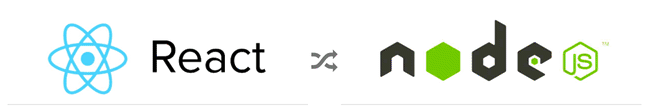
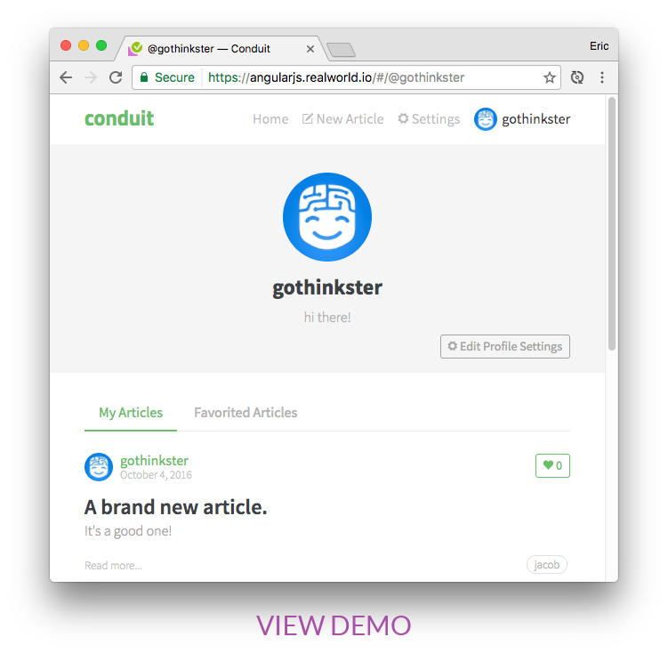

<p align="center" style="margin-top: 30px;">

</p>

<a href="https://demo.realworld.io/"></a>

### See how _the exact same_ Medium.com clone (called [Conduit](https://demo.realworld.io)) is built using different [frontends](https://codebase.show/projects/realworld?category=frontend) and [backends](https://codebase.show/projects/realworld?category=backend). Yes, you can mix and match them, because **they all adhere to the same [API spec](https://realworld-docs.netlify.app/docs/specs/backend-specs/introduction)** 😮😎

While most "todo" demos provide an excellent cursory glance at a framework's capabilities, they typically don't convey the knowledge & perspective required to actually build _real_ applications with it.

**RealWorld** solves this by allowing you to choose any frontend (React, Angular, & more) and any backend (Node, Django, & more) and see how they power a real-world, beautifully designed full-stack app called [**Conduit**](https://demo.realworld.io).

_Read the [full blog post announcing RealWorld on Medium.](https://medium.com/@ericsimons/introducing-realworld-6016654d36b5)_

Join us on [GitHub Discussions!](https://github.com/gothinkster/realworld/discussions) 🎉

---

# This repository

This is a single Nx monorepo that implements the RealWorld / Conduit spec **multiple times over** in one workspace — several frontends, several backends, and several database adapters — all sharing a common domain core, a single API contract, and a single set of request handlers. Swap any frontend against any backend against any database without touching the others.

It is **not** an official RealWorld implementation list entry; it is a teaching/reference workspace built on top of the upstream [gothinkster/realworld](https://github.com/gothinkster/realworld) spec and assets.

## Implementations in this repo

| Layer     | Variants                            |
| --------- | ----------------------------------- |
| Frontend  | Angular 21, React 18, Vue 3         |
| Backend   | NestJS 11, Hono 4                   |
| Database  | Prisma (SQLite), Mongoose (MongoDB) |
| API layer | oRPC contracts                      |

# Implementations (upstream)

Over 100 implementations have been created using various languages, libraries, and frameworks. Explore them on [**CodebaseShow**](https://codebase.show/projects/realworld).

# Create a new implementation

[**Create a new implementation >>>**](https://realworld-docs.netlify.app/docs/implementation-creation/introduction)

Or you can [view upcoming implementations (WIPs)](https://github.com/gothinkster/realworld/discussions/categories/wip-implementations).

---

# Repository structure

```
apps/
  client/
    angular/      # Angular 21 SPA (port 4201)
    react/        # React 18 + Vite SPA (port 4202)
    vue/          # Vue 3 + Vite SPA
  server/
    nest/         # NestJS 11 API (port 3000)
    hono/         # Hono 4 API (port 3000)
  e2e/
    api/          # Playwright API e2e (the canonical API test suite)
    cypress/      # Cypress UI e2e
    playwright/   # Playwright UI e2e
libs/
  core/           # Domain core: services, repository interfaces, validators, auth, request context
  dto/            # API contracts (oRPC) + Zod schemas/models + CRUD service interfaces
  api/            # Framework-agnostic request handlers shared by both servers
  db/
    prisma/       # Prisma adapter (SQLite default): repositories, validators, schema, seed
    mongoose/     # Mongoose adapter (MongoDB): repositories, validators, models
  tailwind/       # Shared Tailwind preset
  utils/          # Shared utilities
tools/
  postman/        # Postman collection + env
  mongodb/        # Local MongoDB data dir
  workspace/      # Local Nx executors & generators (e.g. prisma-seed)
docs/             # Upstream RealWorld assets
```

TypeScript path aliases (see [`tsconfig.base.json`](tsconfig.base.json)) map `@realworld/core`, `@realworld/dto`, `@realworld/api`, `@realworld/prisma`, `@realworld/mongoose`, `@realworld/tailwind`, `@realworld/utils`, `@realworld/workspace`.

# Architecture

The workspace is built around three ideas: **contract-first**, **hexagonal domain core**, and **swappable adapters**.

## Contract-first

`libs/dto` is the single source of truth for the API surface. Each resource (`user`, `article`, `comment`, `profile`, `tags`, `favorites`) declares an oRPC contract (`oc.route(...).input(...).output(...)`) backed by Zod schemas in `libs/dto/src/models`. The contracts are aggregated into one `contract` object exported from `libs/dto`.

- Both servers implement the **same** contract.
- Clients (React/Vue) consume the contract via oRPC clients + TanStack Query; Angular uses the same contract through its service layer.
- Hono also generates an OpenAPI document from the contract and serves it at `/api/swagger` (and a Scalar UI at `/docs`).

## Hexagonal domain core

`libs/core` holds the domain logic and **defines the ports**:

- **Services** (`UserService`, `AuthService`, `ProfileService`, `ArticleService`, `CommentService`) orchestrate use cases.
- **Repository interfaces** (`UserRepository`, `ArticleRepository`, …) and **validator interfaces** are declared here and implemented per database adapter.
- `Context` (`libs/core/src/common/context.ts`) carries the authenticated token/username and is threaded through services.
- `createServices` (`libs/core/src/services.ts`) wires a `Context`, a bundle of repositories, a bundle of validators, and a `JwtSigner` into the `Services` bundle. The `JwtSigner` is app-specific (Hono uses `hono/jwt`, Nest uses `@nestjs/jwt`), so each server supplies its own.

## Database adapters

Two adapters implement the `libs/core` ports:

- **Prisma** (`libs/db/prisma`) — default, backed by SQLite (`libs/db/prisma/prisma/schema.prisma`). Exposes `PrismaUserRepository`, `PrismaArticleRepository`, … and matching validators, plus a `PrismaClientFactory`.
- **Mongoose** (`libs/db/mongoose`) — backed by MongoDB. Exposes `MongoUserRepository`, …, validators, and a `MongoClientFactory`.

Switching adapters is an environment setting (`database.adapter: 'prisma' | 'mongoose'`); no service or handler code changes.

## Shared handlers

`libs/api` contains framework-agnostic handlers (e.g. `getArticles`, `createArticle`, `login`). Each handler takes a `HandlerContext` — `{ services, user? }` — and returns DTOs. Each server is only responsible for:

1. authenticating the request,
2. building the `Services` bundle from the chosen adapter,
3. mapping its framework request into a `HandlerContext` and invoking the shared handler.

This keeps the business logic in one place and the framework glue thin.

## Servers

- **NestJS** (`apps/server/nest`) — Express under Nest, Passport JWT/local strategies, `@nestjs/serve-static` for assets, a `docs` controller, and per-resource controllers that delegate to the shared handlers. Built with `@nx/webpack`. Auth via `@nestjs/jwt`; the Nest-specific `JwtSigner` is in `modules/auth`.
- **Hono** (`apps/server/hono`) — Hono on `@hono/node-server`, middleware stack (`secureHeaders`, `etag`, `compress`, `csrf`, `logger`, `trimTrailingSlash`), oRPC `OpenAPIHandler` mounted at `/api`, OpenAPI generation + Scalar docs. Built with `@nx/esbuild`. Auth via `hono/jwt`; the Hono-specific `JwtSigner` is in `modules/auth`. Request context is assembled in `router/bootstrap.ts`.

## Frontends

All three consume the same API (proxied to `http://localhost:3000/api` in dev — see each app's `proxy.conf.json` / `vite.config.ts`):

- **Vue 3** (`apps/client/vue`) | `:4200` — Vite, Vue Router, TanStack Vue Query, VueUse.
- **Angular 21** (`apps/client/angular` | `:4201`) — standalone components, `@ngneat/query`, router modules per feature.
- **React 18** (`apps/client/react`) | `:4202` — Vite, React Router, TanStack Query, Jotai.

# Configuration

## Per-app environment files

Each app carries an `environment/environment.ts` (dev), `environment.prod.ts` (prod), and `environment.model.ts` (the `Environment` type). Production builds swap the dev file for the prod file via `fileReplacements` in each `project.json`.

**Servers** (`apps/server/{nest,hono}/src/environment/environment.model.ts`):

```ts
export interface Environment {
  production: boolean;
  port: number;
  database: { adapter: 'prisma' } | { adapter: 'mongoose'; uri: string };
  jwt: { secret: string; expiresIn: ... };
}
```

Defaults ship as `port: 3000`, `database.adapter: 'prisma'`, `jwt.secret: 'nest'`. **Override the JWT secret before exposing the server** (see [Launch commands](#launch-commands)).

**Clients** (`apps/client/{angular,vue}/src/environment/environment.model.ts`):

```ts
export interface Environment {
  production: boolean;
  apiUrl: string;
}
```

React has no environment model file; it proxies `/api` to the server via Vite.

## TypeScript paths

[`tsconfig.base.json`](tsconfig.base.json) defines `@realworld/*` aliases consumed by every app/lib. Keep these in sync when adding a library.

# Launch commands

The workspace uses **pnpm** (`packageManager: pnpm@10.33.0`) and **Nx 22**.

## Install

```bash
pnpm install
```

## Build

```bash
# Build every project (excludes the workspace tooling)
pnpm build
# equivalent to: pnpm exec nx run-many --target=build --exclude='workspace' --parallel
```

## Serve a backend (pick one)

```bash
pnpm exec nx serve nest   # NestJS, http://localhost:3000/api
pnpm exec nx serve hono   # Hono,    http://localhost:3000/api (also /api/swagger, /docs)
```

Both default to the Prisma/SQLite adapter and port 3000. To run them simultaneously, change one server's `environment.port`. The server `serve` targets depend on `prisma-generate`, so the Prisma client is generated automatically.

## Run the built server

```bash
# From package.json — sets PORT and a placeholder JWT secret (replace it!)
PORT=3000 JWT_SECRET=do-not-use-in-prod node dist/apps/server/nest
```

For a real deployment, set `JWT_SECRET` to a strong secret and (for the Mongoose adapter) provide `database.uri`.

## Serve a frontend (pick one)

```bash
pnpm exec nx serve vue       # http://localhost:4200
pnpm exec nx serve angular   # http://localhost:4201
pnpm exec nx serve react     # http://localhost:4202
```

Each frontend proxies `/api` to `http://localhost:3000` (the backend), so start a backend first. Angular's proxy also forwards `/hono-api`.

## Prisma (database) commands

```bash
pnpm exec nx prisma-generate prisma    # generate the Prisma client
pnpm exec nx prisma-migrate  prisma    # create/apply migrations
pnpm exec nx prisma-push     prisma    # push schema to the DB
pnpm exec nx prisma-seed     prisma    # seed (uses the local prisma-seed executor)
pnpm exec nx prisma-studio   prisma    # open Prisma Studio
pnpm exec nx prisma-reset    prisma    # reset the DB (force)
```

## Testing & linting

```bash
# pnpm exec nx run-many --target=test     # run all unit tests
pnpm exec nx run-many --target=lint     # lint all projects
```

# Learn more

- ["Introducing RealWorld 🙌"](https://medium.com/@ericsimons/introducing-realworld-6016654d36b5) by Eric Simons
- Every tutorial is built against the same [API spec](https://realworld-docs.netlify.app/docs/specs/backend-specs/introduction) to ensure modularity of every frontend & backend
- There is a hosted version of the backend API available for public usage, no API keys are required
- Interested in creating a new RealWorld stack? View the [upstream starter guide & spec](https://realworld-docs.netlify.app/docs/implementation-creation/introduction)
